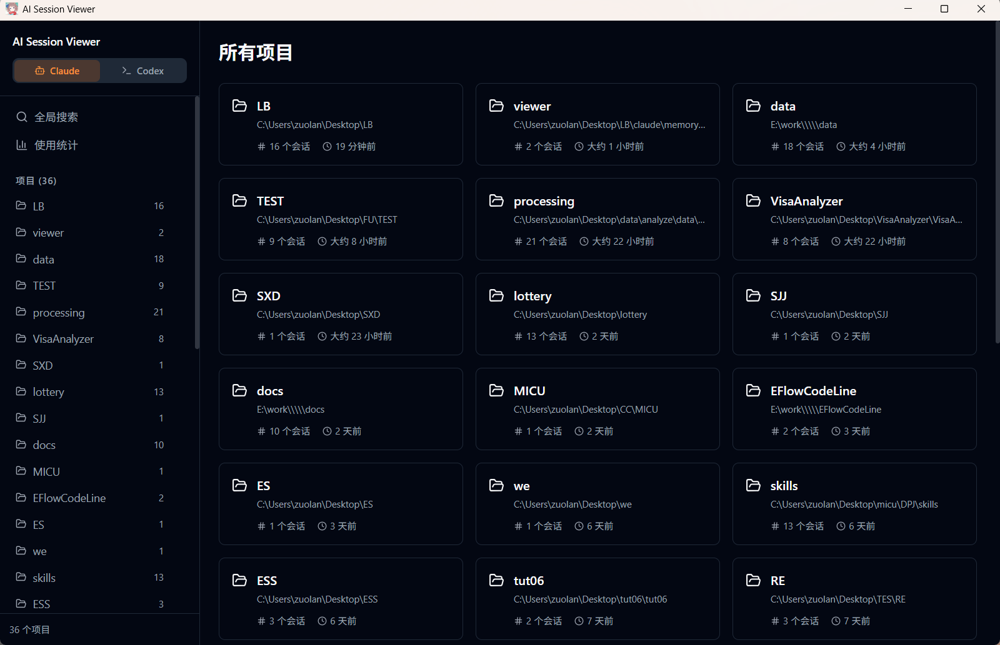
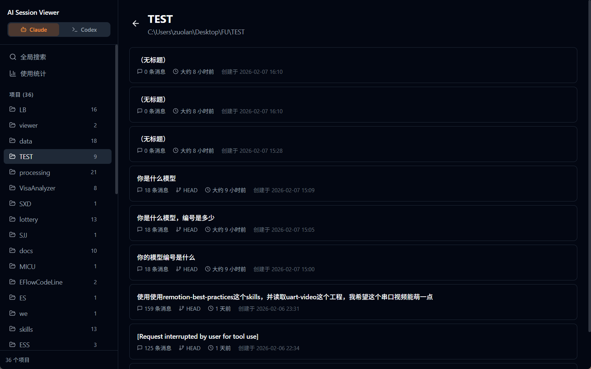
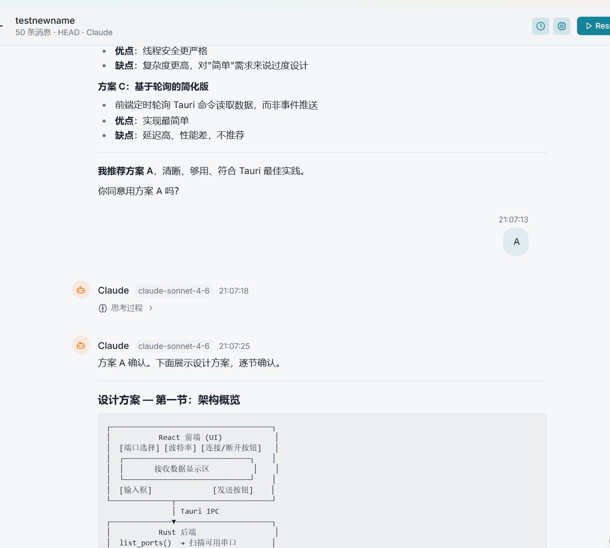
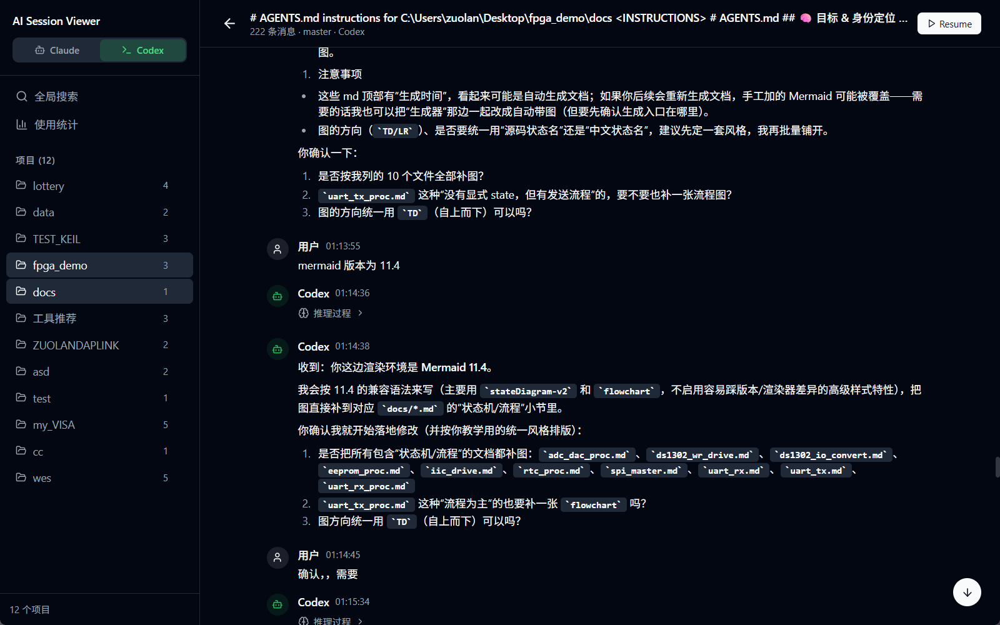
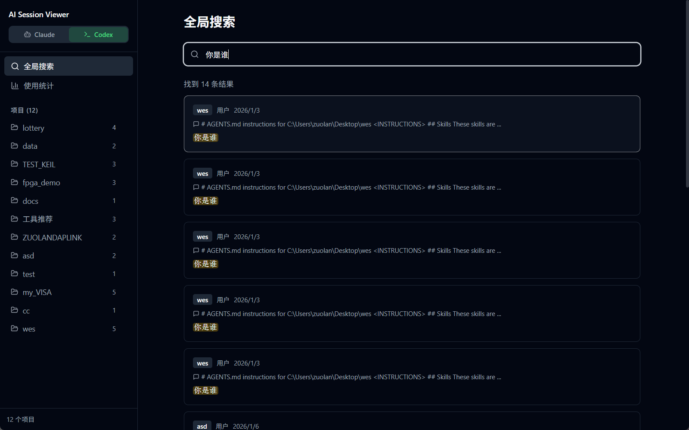
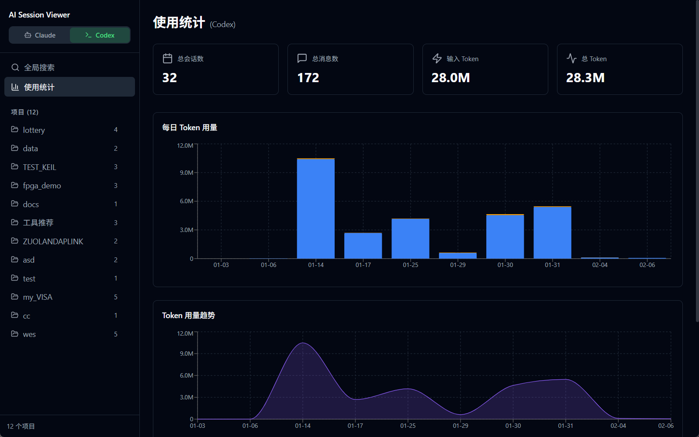

# AI Session Viewer

[简体中文](./README.md) | **English**

<p align="center">
  
</p>

<p align="center">
  <strong>A unified local session browser for Claude Code, Codex CLI, Grok CLI, and Oh My Pi</strong>
</p>

<p align="center">
  <a href="https://github.com/zuoliangyu/AI-Session-Viewer/releases"></a>
  <a href="https://github.com/zuoliangyu/AI-Session-Viewer/actions"></a>
  <a href="LICENSE"></a>
</p>

Browse, search, export, organize, and resume local AI coding conversations in one interface. All four sources support session browsing, search, export, tags, aliases, deletion, and resume commands. Claude, Codex, and Oh My Pi also support chatting inside the app.

The viewer reads local session files. Browsing does not upload them to a cloud service. Editing metadata, deleting sessions, connecting to remote nodes, syncing configuration, or starting a CLI conversation are explicit user actions.

**Interface language:** Chinese is the default on every system. To use English, click the gear in the lower-left corner, open **显示设置 (Display)**, and select **English** under **界面语言 / Language**. The change takes effect immediately and is remembered after restarting. Session content and custom names are not translated.

**What's new in v2.22.1:** Chinese and English interfaces with a saved language preference (Chinese by default), localized relative times, and bilingual READMEs. Tauri CLI is upgraded to `2.11.4`, including the fix for relative `.DirIcon` and `.desktop` links in AppImages. Lightweight checks now cover localization and the packaging dependency. See [CHANGELOG.md](./CHANGELOG.md) for release history.

## Screenshots

The screenshots below show the Chinese interface. English is available in Display settings.

<table>
  <tr>
    <td></td>
    <td></td>
  </tr>
  <tr>
    <td></td>
    <td></td>
  </tr>
  <tr>
    <td></td>
    <td></td>
  </tr>
</table>

## Quick start

### Desktop

Download an installer or portable package from [Releases](https://github.com/zuoliangyu/AI-Session-Viewer/releases).

| Platform | Packages |
|---|---|
| Windows | `.msi`, NSIS `.exe`, or portable `.zip` |
| macOS (Universal) | `.dmg` for Intel and Apple Silicon |
| Linux | `.deb` or `.AppImage` |

Open the application to scan local session directories. You must have used at least one supported CLI and have its session files available.

| Source | Session location |
|---|---|
| Claude Code | `~/.claude/projects/` |
| Codex CLI | `~/.codex/sessions/` |
| Grok CLI | `$GROK_HOME/sessions/`, or `~/.grok/sessions/` |
| Oh My Pi | Default/named profile session directories under `~/.omp/agent/`, or an initialized `$XDG_DATA_HOME/omp/` on Linux/macOS |

### Web server

The Linux web server is a static musl executable. It runs without WebKit or other desktop GUI dependencies.

```bash
chmod +x ./session-web

# Default: loopback only (127.0.0.1:3000)
./session-web

# Network access: a token is required when binding to a non-loopback address
./session-web --host 0.0.0.0 --port 8080 --token my-secret

# Equivalent environment variables
ASV_HOST=0.0.0.0 ASV_PORT=8080 ASV_TOKEN=my-secret ./session-web
```

| Option | Environment variable | Default |
|---|---|---|
| `--host` | `ASV_HOST` | `127.0.0.1` |
| `--port` | `ASV_PORT` | `3000` |
| `--token` | `ASV_TOKEN` | None; required for non-loopback hosts |
| `--allow-no-auth` | `ASV_ALLOW_NO_AUTH` | Off; allow a non-loopback host without a token (unsafe) |
| `--allowed-origins` | `ASV_ALLOWED_ORIGINS` | None; extra comma-separated origins allowed for CORS / WebSockets |
| `--allow-skip-permissions` | `ASV_ALLOW_SKIP_PERMISSIONS` | Off; let chat clients request `--dangerously-skip-permissions` |
| `--allow-client-credentials` | `ASV_ALLOW_CLIENT_CREDENTIALS` | Off; let chat clients supply their own API key / base URL |

### Docker

```bash
docker compose up -d
```

Configure mounts, ports, and `ASV_TOKEN` in [docker-compose.yml](./docker-compose.yml).

| | Native web executable | Docker |
|---|---|---|
| Browse, search, statistics | Supported | Supported |
| Host CLI conversations | Calls the installed host CLI | Host CLIs are inaccessible due to container isolation |
| Runtime requirement | Static Linux executable | Docker |
| Typical use | Personal server with CLI access | Shared history browser |

**Access protection:** session histories may contain source code, credentials, and private conversations. For local use, bind to `127.0.0.1`. For LAN access, configure a token and restrict the port with a firewall. For public access, also use an HTTPS reverse proxy such as Nginx or Caddy. The server itself does not provide HTTPS; tokens sent over plain HTTP are not encrypted.

### Desktop and web differences

| Feature | Desktop | Web |
|---|---|---|
| Resume | Open a system terminal | Copy a resume command |
| Fork | Create a session and open its terminal | Create and navigate to the new session |
| In-app chat | Local CLI process | Server CLI through WebSocket |
| Updates | In-app updater / release link | Manual deployment |
| File changes | Tauri events | WebSocket events |
| Authentication | None for local IPC | Optional bearer token |

### Multiple machines

Register `session-web` root URLs in the sidebar's machine selector. Each node has its own token and connection status. Browsing, search, statistics, file watching, and chat use the selected node. The desktop's local node continues to use Tauri IPC.

- Use an `http://` or `https://` root URL without embedded credentials.
- Remote folder selection and resume behavior follow web mode, even from the desktop app.
- Node preferences stay in the current client's localStorage.
- Statistics are displayed per node rather than merged.
- See [MULTI_NODE_SYNC_DESIGN.md](./MULTI_NODE_SYNC_DESIGN.md) for synchronization boundaries.

## Features

### Navigation and display

- Switch between Claude, Codex, Grok, and Oh My Pi in the sidebar. Hide unused agents in **Settings → Display**, keeping at least one visible.
- Main navigation provides projects, search, bookmarks, and statistics. Skills, invalid items, the recycle bin, and provider sync are under **Tools & management**.
- Project filtering and the five most recently viewed sessions are saved locally and separated by machine and source.
- Projects and sessions use card grids by default. List/grid preferences are saved independently, with virtualized rows for large collections.
- Below 1024px, navigation becomes a drawer. Below 1280px, the question index overlays the reader and can be dismissed with Escape.
- Select Chinese or English in **Settings → Display → Language**. The default is Chinese regardless of system locale; language preference is saved per browser or desktop WebView. UI labels, dialogs, application hints, and relative times follow this choice. Raw session text and CLI/server diagnostics remain unchanged.
- Time zone is configured independently. Choose the system zone or an IANA zone; timestamps and statistics date boundaries follow it without changing stored UTC data.
- Light, dark, and system themes are available at the bottom of the sidebar.

### Projects and sessions

Projects are sorted by recent activity and show session counts and timestamps. Incremental caches re-read new or changed history files, including changes made while the app was closed. Manual cache refresh is also available.

The project Actions menu offers path copying and session-data deletion. Claude additionally supports project aliases and related configuration cleanup. Batch selection supports deleting multiple projects, with recoverable operations moved to the recycle bin.

Session cards show the first prompt or alias, message count, branch, and creation/modification times. Codex internal/noninteractive sessions are filtered out. Grok reads `summary.json` and `chat_history.jsonl`. Oh My Pi supports named profiles, initialized XDG directories, and related artifact directories.

- Export one or many sessions as JSON, Markdown, or HTML. Desktop uses a file dialog; web mode downloads through the browser.
- Add aliases and tags, filter by tags, and bookmark entire sessions or individual messages.
- Claude aliases synchronize with Claude Code's `/rename`.
- Review empty or corrupt sessions in the invalid-items page before deleting them. Its desktop deletion moves sessions to the recycle bin; its web deletion is permanent.
- The recycle bin supports restoring original paths, removing orphan directories, and permanent deletion after confirmation.

### Reading conversations

Markdown, syntax highlighting, tool calls/results, and collapsible thinking/reasoning blocks are supported. The latest 30 messages load first; earlier messages load on demand without losing the scroll position. Large blocks initially use plain-text previews, with Markdown rendering available explicitly.

The reader provides message, question-summary, and Codex trace views. Display options control timestamps, model names, expansion, and split panes. The Details menu contains session metadata, costs, and resume commands. The question index starts collapsed and remembers your preference.

The Codex trace view includes turns, approximate steps, tool duration and failures, reasoning, sub-agents, context compaction, and token breakdowns. It handles legacy and `history_base` segmented rollouts; see [TRAJECTORY.md](./TRAJECTORY.md).

### Resume and fork

Resume a session through its CLI or continue Claude, Codex, and Oh My Pi conversations inside the app. Grok provides a terminal command.

Fork buttons appear below user questions and in the question summary. Forking creates an independent session containing earlier history and the selected turn's full reply, including tool calls and results. Later turns are excluded and the original is preserved.

- Desktop local mode opens a terminal and navigates to the new session. If terminal launch fails, the created fork remains available for retry.
- Web and remote-node forks are created on the server hosting the session.
- Codex uses native `codex app-server` fork operations and verifies history boundaries. Unsupported or stale positions fail explicitly rather than silently copying the wrong history.
- Oh My Pi follows the selected node's ancestor chain and copies attachments.
- Grok preserves raw history and prompt context while generating a new session identity.

`POST /api/sessions/fork` accepts `{ source, originalFilePath, userMsgUuid }` and returns `{ newSessionId, newFilePath, projectPath, projectId }`. Existing authentication and source-specific path validation apply.

### Search and statistics

Search across projects by message content, session names, and tags. Switch between individual matches and results grouped by session. Selecting a result jumps to the matching message.

Token and cost statistics currently support **Claude and Codex**. They include input/output/cache tokens, USD costs, cache hit rates, daily/hourly trends, model usage, and the top ten projects by cost. Models without pricing are marked **Unpriced**.

Per-request costs support project, model, and date filters; a row opens the corresponding message. Session cost details can be copied as a Markdown table. Time-zone selection controls date boundaries. Statistics cover files present on the selected machine and source.

### In-app chat

Choose **New chat**, select a working directory, and use an installed Claude, Codex, or Oh My Pi CLI. Replies stream with Markdown and tool viewers for Read, Edit, Write, Bash, Grep, and Glob. Long conversations use virtual scrolling.

The app remembers model choices, supports custom model IDs, and attempts to match the historical model when resuming. Use `/model` or Ctrl+K to switch models. Chat settings include CLI paths, API/base-URL overrides, Windows terminal choice, and permission mode.

### Skills, MCP, and plugins

Browse global, project, and plugin skills, view `SKILL.md`, and import ZIP archives. Plugin skills are read-only. Deleting a symbolic-link skill removes the link only; deleting a real skill directory is permanent.

Global Claude skills can be synchronized between two accessible `session-web` nodes after reviewing additions and conflicts. Overwrites are backed up, written files are checked, and failed writes restore the previous version. Backups live in the target's `ai-session-viewer/skill-backups/` configuration directory.

MCP sync compares Claude `mcpServers` and Codex `mcp_servers`. Sensitive and machine-specific values are redacted from transfers. Existing target secrets are preserved, stale previews are rejected, and writes are backed up to `ai-session-viewer/config-backups/`.

Plugin declarations are preview-only. Plugin caches, installation directories, artifacts, and credentials are not copied; install plugins using the target machine's normal CLI workflow.

### Codex provider sync

After changing providers, old rollouts and SQLite metadata may still reference the previous provider and disappear from Codex Desktop or `/resume`. Provider sync aligns rollout headers, SQLite threads, and global-state paths, optionally updating `model_provider` in `config.toml`.

Changes are backed up to `~/.codex/backups_state/provider-sync/`; restoration can select configuration, database, sessions, and global state separately. Encrypted history may still fail to resume across providers with `invalid_encrypted_content`. Use the original provider when reliable resume is required.

### Updates and file watching

Installed desktop packages use the in-app updater. Windows portable packages link to GitHub Releases. Updates can be checked in Settings, and individual versions can be skipped.

Desktop and web file watchers batch changed paths to refresh affected projects. Desktop also performs a periodic background refresh. Metadata, indexes, and bookmarks use atomic writes.

## Development

### Requirements

- Node.js 22 or newer; `.nvmrc` selects the project's Node version.
- A Rust toolchain compatible with the workspace's Tauri dependencies.
- Session data from at least one supported CLI.

Desktop platform dependencies:

| Platform | Requirements |
|---|---|
| Windows | Visual C++ Build Tools and WebView2 |
| macOS | Xcode command-line tools (`xcode-select --install`) |
| Ubuntu/Debian | `libwebkit2gtk-4.1-dev libappindicator3-dev librsvg2-dev patchelf` |

The web server does not need desktop WebKit/GUI libraries.

### Run locally

```bash
git clone https://github.com/zuoliangyu/AI-Session-Viewer.git
cd AI-Session-Viewer
npm ci
npx tauri dev
```

Use `npx tauri dev` for desktop development: it starts both the Rust backend and Vite. Running Vite alone does not provide a desktop backend.

Windows provides `./menu.ps1`; Linux/macOS provide `./menu.sh`. Script details are in [scripts/README.md](./scripts/README.md). For web development, use `npm run dev:web`.

### Build and validate manually

```bash
# Desktop packages
npx tauri build

# Web executable
npm run build:web && cargo build -p session-web --release

# Docker image
docker build -t ai-session-viewer-web .

# Lightweight regression checks
npm run check:scripts

# Rust lint and TypeScript validation
cargo clippy --workspace -- -D warnings
npx tsc --noEmit
```

Desktop artifacts are in `target/release/bundle/`; the web executable is `target/release/session-web`. Local menu builds disable updater artifacts and do not require a signing key. Release CI uses repository signing secrets.

**AppImage:** the project pins `@tauri-apps/cli` to **2.11.4**, which includes [Tauri #15596](https://github.com/tauri-apps/tauri/pull/15596). It creates relative `.DirIcon` and root `.desktop` symlinks, so they remain valid outside the build machine. Install dependencies from the lockfile. `node scripts/check-appimage.mjs` checks the version pin; Linux artifact extraction and launch still require manual verification. See [the artifact checklist](./scripts/README.md#appimage-产物验证).

The interface remains Chinese by default. Providing an English option alone does not satisfy the AppImage catalog's request for English by default outside Chinese locales.

**Translations:** edit both dictionaries in `src/i18n/locales/`. Components use `useTranslation`; utilities share the same i18next instance. Keep placeholders consistent and do not translate user content. See [src/i18n/README.md](./src/i18n/README.md).

## Architecture

| Layer | Technology |
|---|---|
| Desktop | Tauri v2, Rust, system WebView |
| Web server | Axum + WebSocket |
| Frontend | React 19, TypeScript, Vite 6 |
| UI | Tailwind CSS, lucide-react |
| State | Zustand 5 |
| Localization | i18next + react-i18next |
| Rendering | react-markdown, remark-gfm, react-syntax-highlighter |
| Charts | Recharts |
| Shared backend | `session-core` Rust crate |

The Cargo workspace contains `crates/session-core`, `src-tauri`, and `crates/session-web`. Shared React components use `api.ts`, which selects Tauri IPC or HTTP/WebSocket via the compile-time `__IS_TAURI__` flag. Providers parse source-specific files into shared project, session, and display-message models.

### API overview

The web API uses `source=claude|codex|grok|omp` where applicable. Authenticated deployments require a bearer token.

| Method | Endpoint | Purpose |
|---|---|---|
| GET | `/api/projects`, `/api/sessions` | List projects and sessions |
| DELETE | `/api/sessions` | Delete a session |
| GET | `/api/messages` | Paginated messages (`filePath`, `page`, `pageSize`, `fromEnd`) |
| POST | `/api/sessions/fork` | Fork a session |
| PUT | `/api/sessions/meta` | Update alias and tags |
| GET | `/api/trajectory` | Codex trace records |
| GET | `/api/export` | JSON / Markdown / HTML export |
| GET | `/api/scan-progress` | Initial scan progress |
| GET | `/api/search`, `/api/tags`, `/api/cross-tags` | Search and tags |
| GET | `/api/stats`, `/api/stats/requests`, `/api/stats/projects`, `/api/stats/session` | Usage and cost statistics |
| GET, POST | `/api/bookmarks` | List or add bookmarks |
| DELETE | `/api/bookmarks/:id` | Remove a bookmark |
| GET | `/api/cli/detect`, `/api/cli/config` | CLI detection and masked configuration |
| POST | `/api/models` | List models |
| GET, DELETE | `/api/skills` | List or delete skills |
| GET | `/api/skills/content` | Read SKILL.md |
| POST | `/api/skills/import` | Import a ZIP archive |
| GET | `/api/provider-sync/status` | Provider metadata status |
| POST | `/api/provider-sync/sync`, `/api/provider-sync/switch` | Sync or change provider |
| POST | `/api/provider-sync/restore`, `/api/provider-sync/prune` | Restore or prune backups |
| WS | `/ws`, `/ws/chat` | File events and CLI chat |

## Releases and contributing

The version in `package.json` is authoritative. Run `npm run sync-version` to synchronize Cargo manifests and Tauri configuration. Pushing a version tag triggers desktop packages, the Linux web executable, Docker images, updater signatures, and the release manifest.

Issues and pull requests are welcome. See [CHANGELOG.md](./CHANGELOG.md) for release history and the [Chinese README](./README.md#路线图) for the feature checklist.

## License

[MIT](./LICENSE). Third-party licenses are listed in [THIRD_PARTY_NOTICES.md](./THIRD_PARTY_NOTICES.md).
