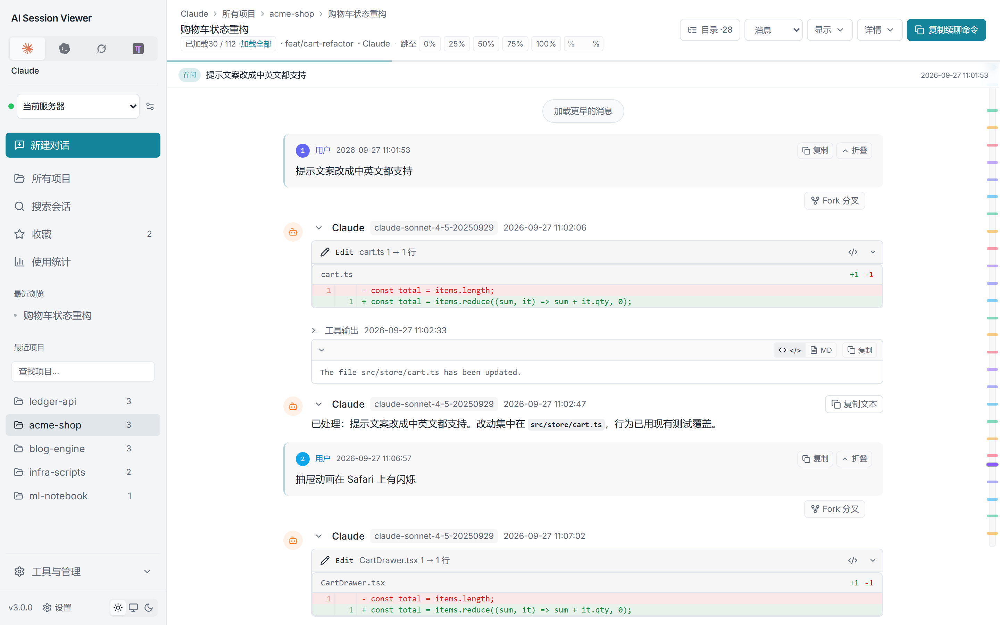
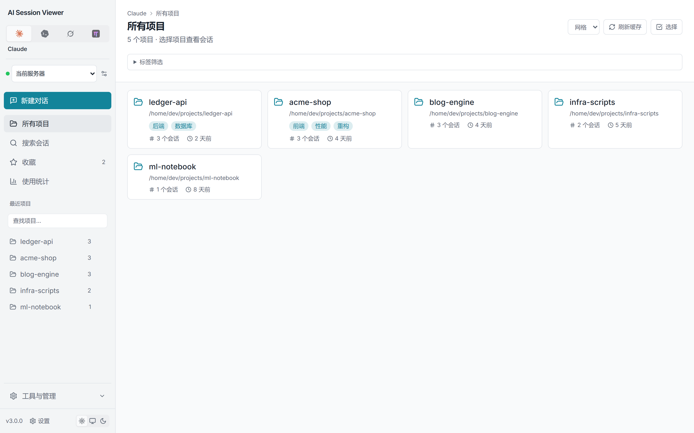
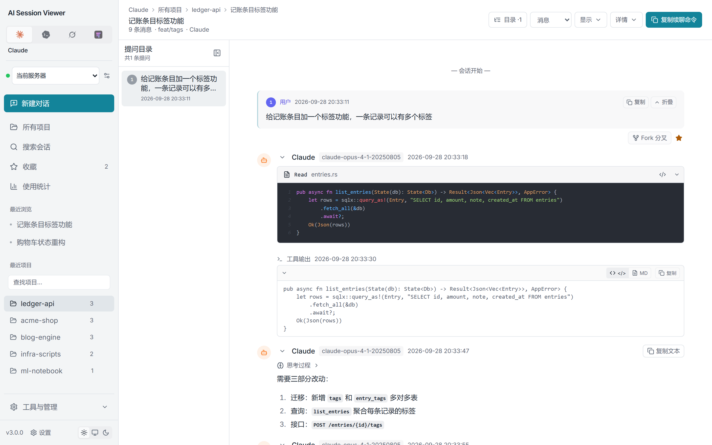
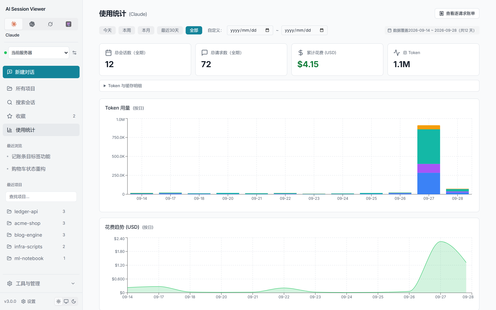

# AI Session Viewer

**简体中文** | [English](./README.en.md)

<p align="center">
  
</p>

<p align="center">
  <strong>Claude Code、Codex CLI、Grok CLI 与 Oh My Pi 本地会话的统一可视化浏览器</strong>
</p>

<p align="center">
  <a href="https://github.com/zuoliangyu/AI-Session-Viewer/releases">
    
  </a>
  <a href="https://github.com/zuoliangyu/AI-Session-Viewer/actions">
    
  </a>
  <a href="https://github.com/zuoliangyu/AI-Session-Viewer/blob/main/LICENSE">
    
  </a>
</p>

---

**AI Session Viewer** 是一个轻量级应用，让你可以在一个统一界面中浏览、搜索来自 [Claude Code](https://docs.anthropic.com/en/docs/claude-code)、[OpenAI Codex CLI](https://github.com/openai/codex)、Grok CLI 和 [Oh My Pi](https://github.com/can1357/oh-my-pi) 的本地会话。四种来源均支持浏览、搜索、导出、标签/别名、删除、分叉与一键恢复（Resume）；Claude 与 Codex 还支持在应用内继续对话（调用本机安装的 CLI）。

本应用**仅处理本地会话文件**，不上传任何数据；删除、标签、别名等写操作只在用户主动触发时执行。

> **What's New（v3.0.0）**：界面重排——统一面包屑页头、独立设置页、紧凑的来源切换与「最近项目」侧栏，长会话右侧位置条标出每个提问；新建对话完成后自动转入会话页，会话页输入框常驻。Web 服务加固：默认只监听本机、非本机监听必须设置令牌、WebSocket 校验来源。应用内续聊聚焦 Claude 与 Codex；Web 端删除改为进回收站。流式输出与搜索明显更快。
>
> ⚠️ **从 2.x 升级**：包含不兼容变更（Web 默认监听地址、令牌、续聊范围），详见 [CHANGELOG.md](./CHANGELOG.md#300---2026-09-30)。

## 截图

<table>
  <tr>
    <td></td>
    <td></td>
  </tr>
  <tr>
    <td></td>
    <td></td>
  </tr>
</table>

更多截图（搜索、设置、Codex、暗色主题等）见 [docs/screenshots.md](./docs/screenshots.md)。截图使用虚构演示数据生成。

## 快速开始

### 桌面应用（推荐）

前往 [Releases](https://github.com/zuoliangyu/AI-Session-Viewer/releases) 下载对应平台的安装包：

| 平台 | 安装包 |
|------|--------|
| Windows | `.msi`（安装版）或 `.zip`（便携版） |
| macOS (Universal) | `.dmg`（同时支持 Intel 和 Apple Silicon） |
| Linux | `.deb` / `.AppImage` |

安装后打开即可使用，应用会自动扫描本地的 Claude / Codex / Grok / Oh My Pi 会话数据。

> 前提：至少使用过一种受支持 CLI，对应的 `~/.claude/projects/`、`~/.codex/sessions/`、`$GROK_HOME/sessions/`（默认 `~/.grok/sessions/`）或 Oh My Pi 的 `~/.omp/agent/sessions/` 目录存在。

### Web 服务器

在无 GUI 的服务器上运行，通过浏览器访问：

```bash
./session-web                                  # 仅本机：http://127.0.0.1:3000
./session-web --host 0.0.0.0 --token my-secret  # 局域网 / 公网（必须设置令牌）
```

参数、Docker、安全建议与多机节点见 [docs/deployment.md](./docs/deployment.md)。

## 功能概览

| 功能 | 说明 |
|---|---|
| 四种来源 | Claude Code、Codex CLI、Grok CLI、Oh My Pi 的本地会话，一处浏览 |
| 阅读会话 | Markdown 与代码高亮、工具调用查看器、提问目录与位置条、提问汇总、Codex 轨迹 |
| 整理 | 别名、标签、收藏、导出（JSON / Markdown / HTML）、批量删除进回收站 |
| 继续工作 | 终端一键恢复、从任意提问分叉；Claude 与 Codex 可在应用内续聊 |
| 搜索与统计 | 跨项目全文搜索；Claude / Codex 的 Token、花费与逐请求账单 |
| 多机与 Web | `session-web` 浏览器访问，多节点切换，令牌与来源校验 |
| 其他 | Skills / MCP / 插件管理、Codex Provider 同步、无效项清理、中英文界面、应用内更新 |

每项功能的完整说明见 [docs/features.md](./docs/features.md)。

## 文档

| 文档 | 内容 |
|---|---|
| [截图](./docs/screenshots.md) | 全部界面截图 |
| [功能详解](./docs/features.md) | 每项功能的完整说明 |
| [Web 服务器与部署](./docs/deployment.md) | 参数、Docker、安全、多机节点 |
| [开发指南](./docs/development.md) | 本地开发、构建、技术栈、架构、REST API、发布、路线图 |
| [CHANGELOG](./CHANGELOG.md) | 版本历史 |

## Star History

<a href="https://star-history.com/#zuoliangyu/AI-Session-Viewer&Date">
 <picture>
   <source media="(prefers-color-scheme: dark)" srcset="https://api.star-history.com/svg?repos=zuoliangyu/AI-Session-Viewer&type=Date&theme=dark" />
   <source media="(prefers-color-scheme: light)" srcset="https://api.star-history.com/svg?repos=zuoliangyu/AI-Session-Viewer&type=Date" />
   
 </picture>
</a>

## 贡献

欢迎提交 Issue 和 Pull Request。

## 许可证

[MIT](LICENSE)。第三方许可见 [THIRD_PARTY_NOTICES.md](THIRD_PARTY_NOTICES.md)。
