# Screenshots

[简体中文](./screenshots.md) | **English** · [← Back to README](../README.en.md)

The screenshots use fictional demo data served by the web build in Docker; the desktop app looks the same. They show the Chinese interface — English is available in Settings → Display.

**Projects and sessions**

<table>
  <tr>
    <td></td>
    <td>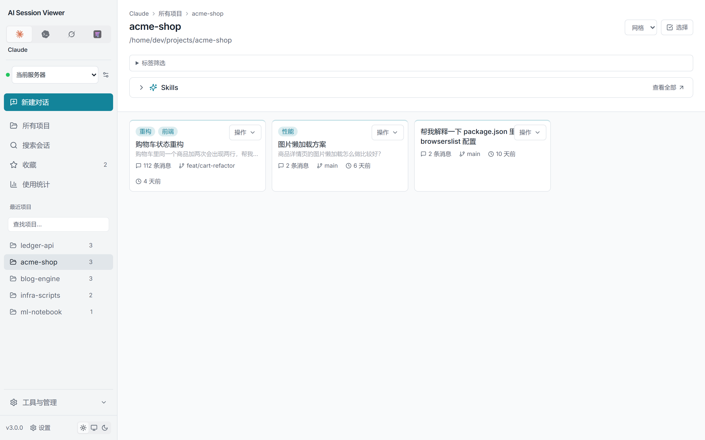</td>
  </tr>
  <tr>
    <td align="center">Projects</td>
    <td align="center">Sessions</td>
  </tr>
</table>

**Reading sessions**

<table>
  <tr>
    <td></td>
    <td>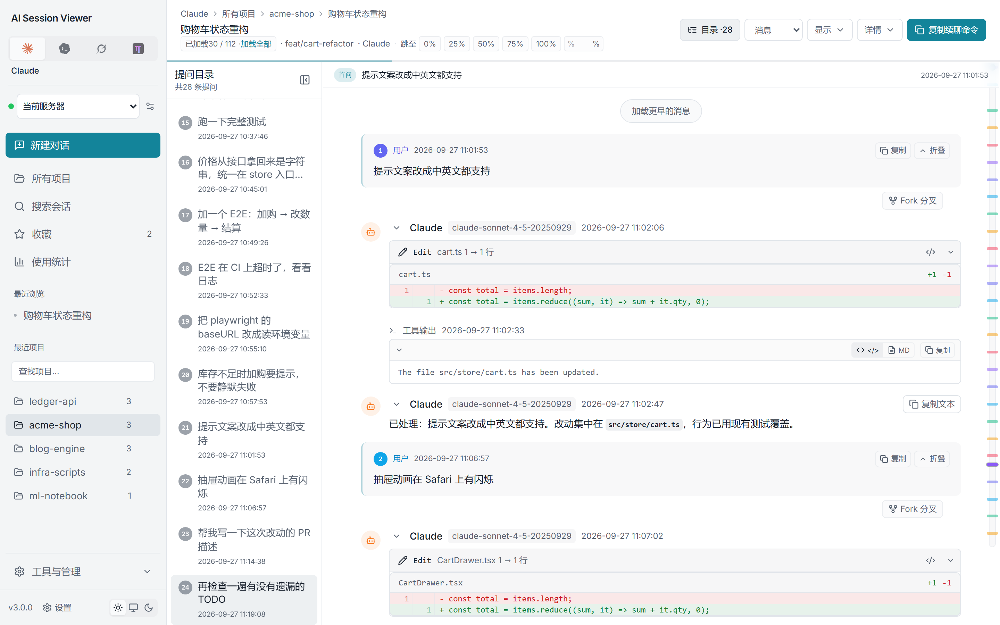</td>
  </tr>
  <tr>
    <td align="center">Messages and position rail</td>
    <td align="center">Question index</td>
  </tr>
  <tr>
    <td></td>
    <td>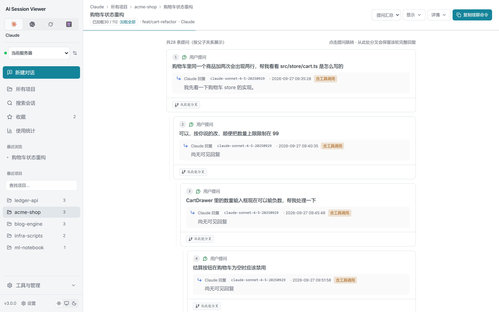</td>
  </tr>
  <tr>
    <td align="center">Tool call viewers</td>
    <td align="center">Question summary</td>
  </tr>
  <tr>
    <td>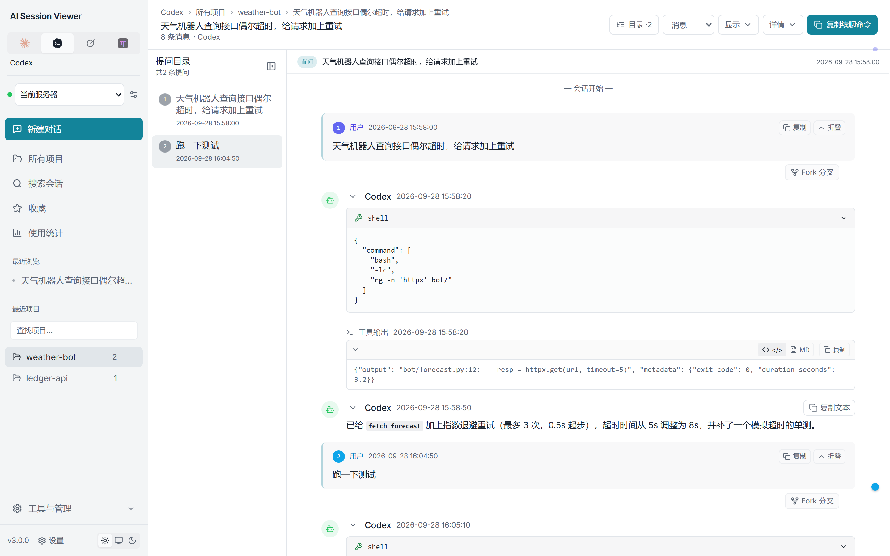</td>
    <td>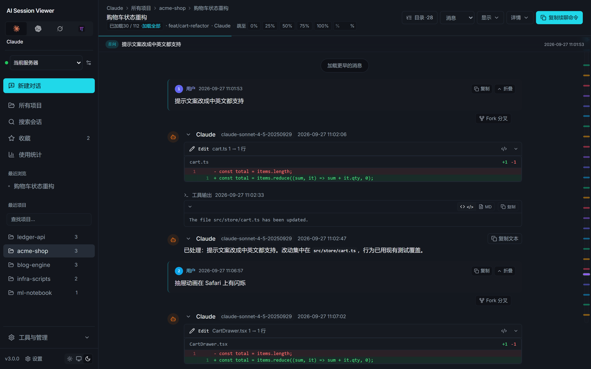</td>
  </tr>
  <tr>
    <td align="center">Codex session</td>
    <td align="center">Dark theme</td>
  </tr>
</table>

**Search, statistics, and settings**

<table>
  <tr>
    <td>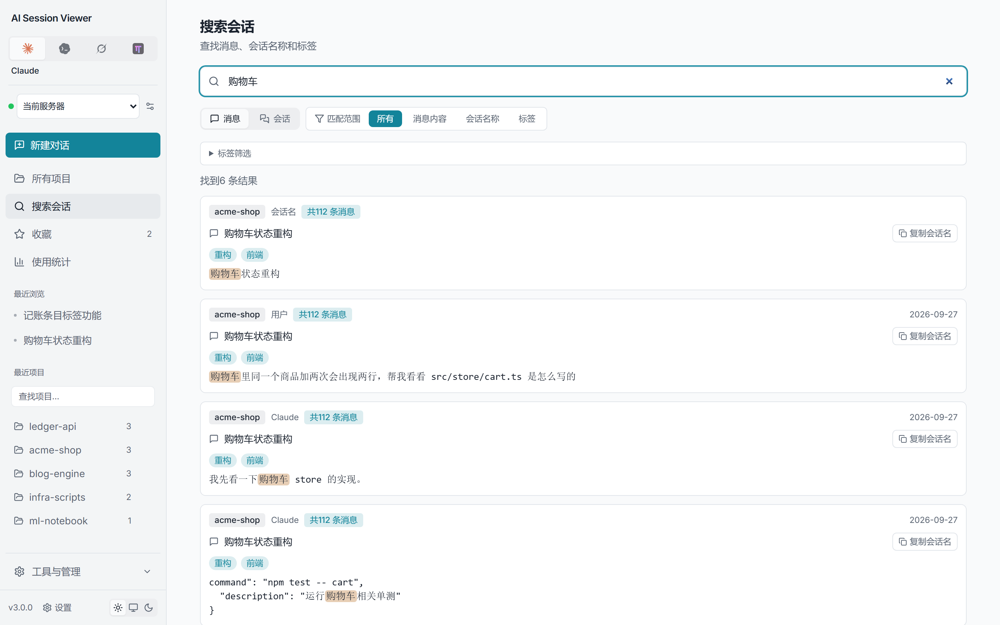</td>
    <td></td>
  </tr>
  <tr>
    <td align="center">Search</td>
    <td align="center">Token and cost statistics</td>
  </tr>
  <tr>
    <td>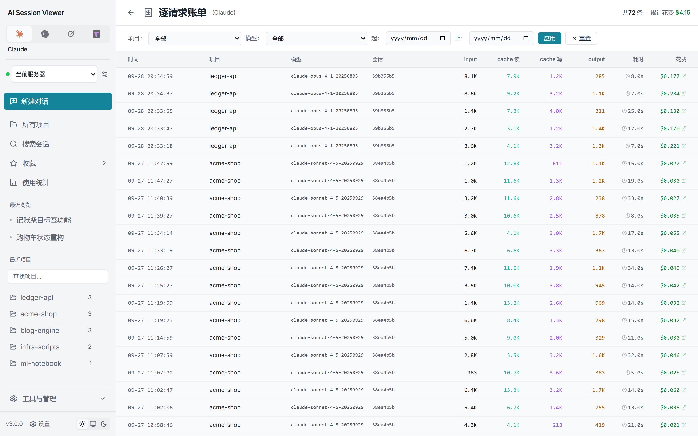</td>
    <td>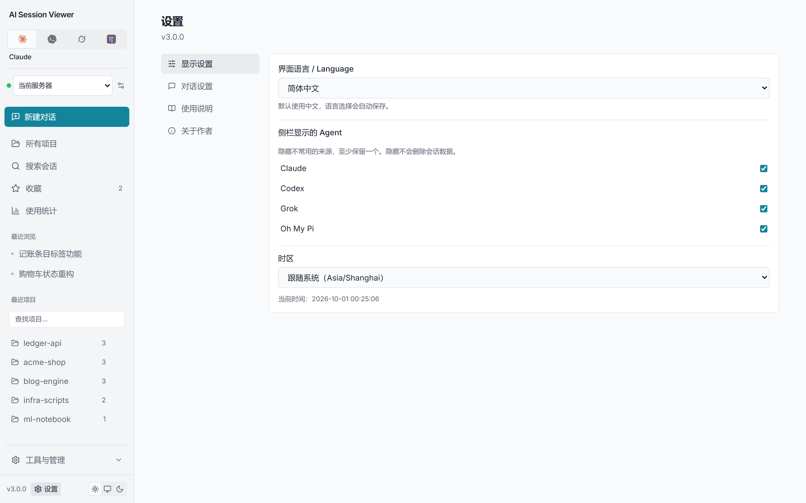</td>
  </tr>
  <tr>
    <td align="center">Per-request costs</td>
    <td align="center">Settings</td>
  </tr>
  <tr>
    <td>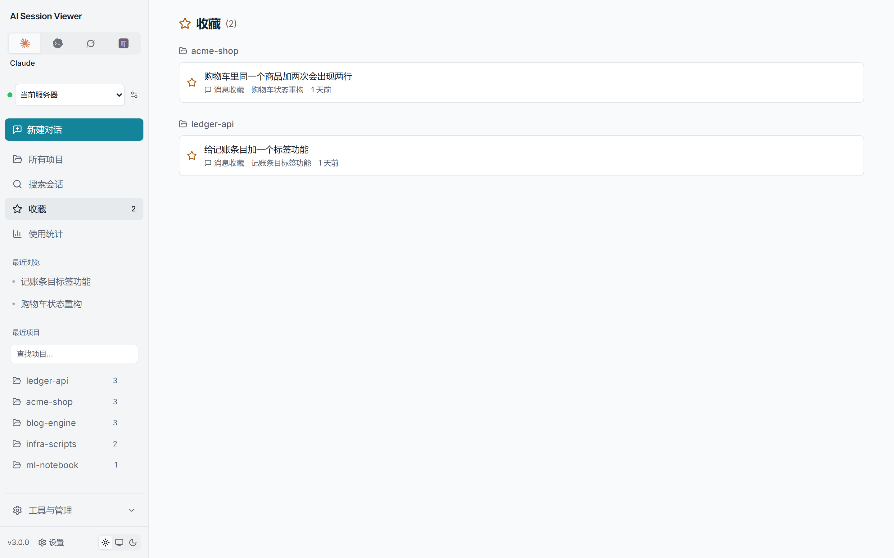</td>
    <td>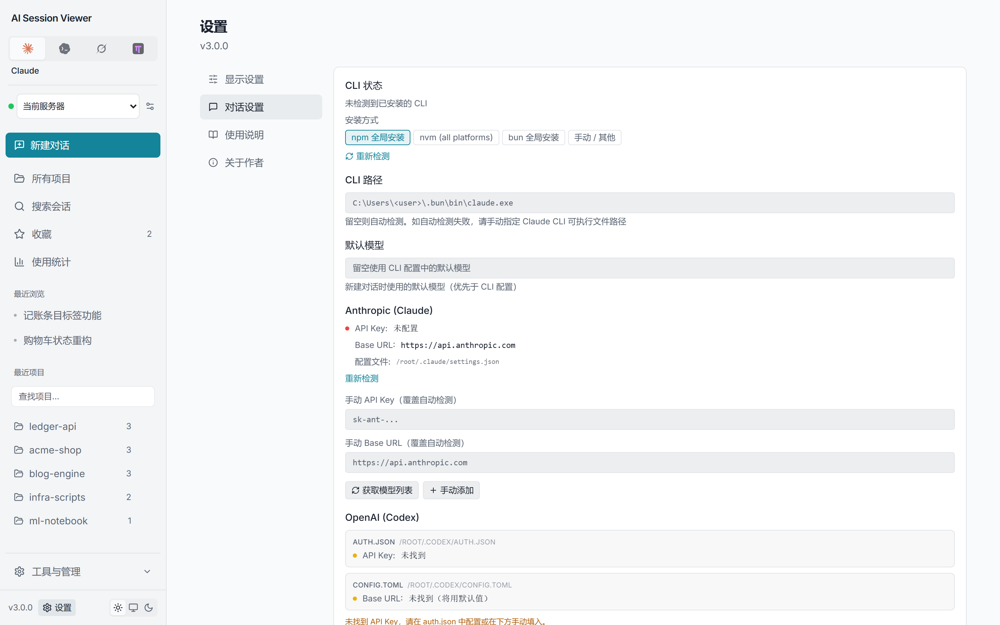</td>
  </tr>
  <tr>
    <td align="center">Bookmarks</td>
    <td align="center">Chat settings</td>
  </tr>
</table>

**Multiple sources and dark theme**

<table>
  <tr>
    <td>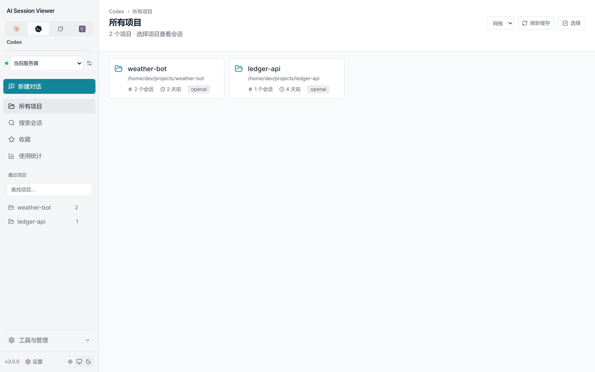</td>
    <td>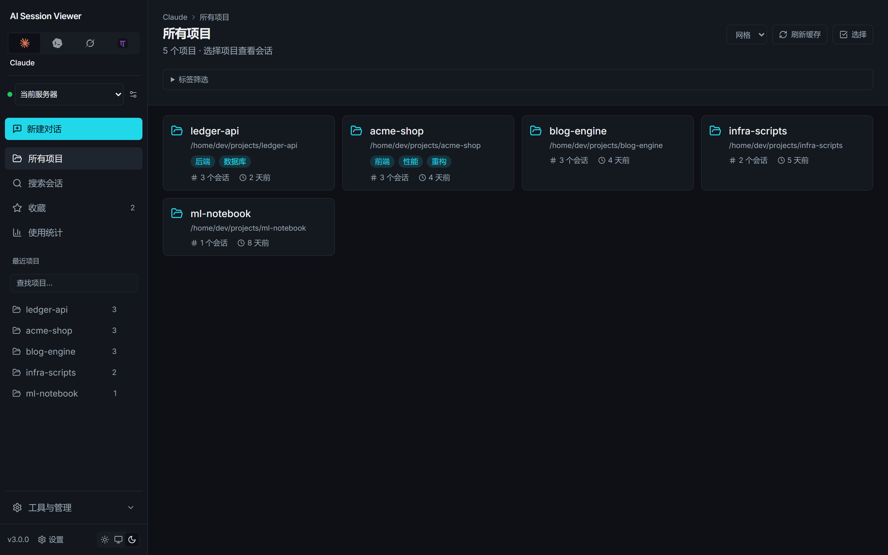</td>
  </tr>
  <tr>
    <td align="center">Switched to Codex</td>
    <td align="center">Dark theme · projects</td>
  </tr>
  <tr>
    <td colspan="2" align="center">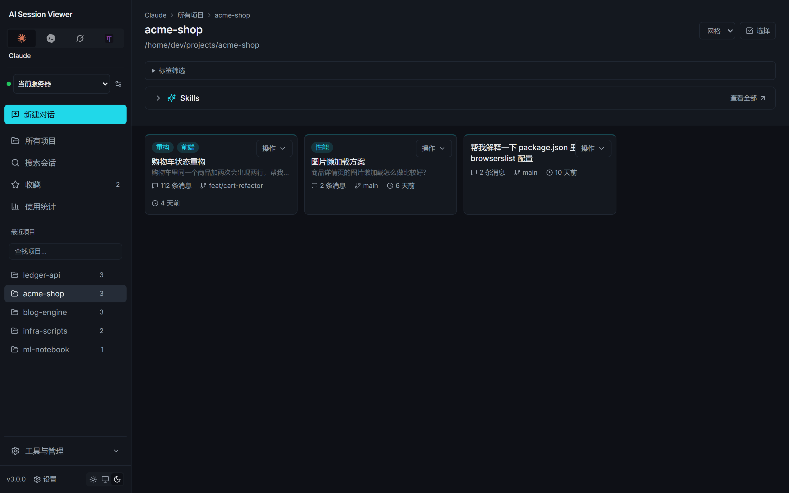 Dark theme · sessions</td>
  </tr>
</table>
